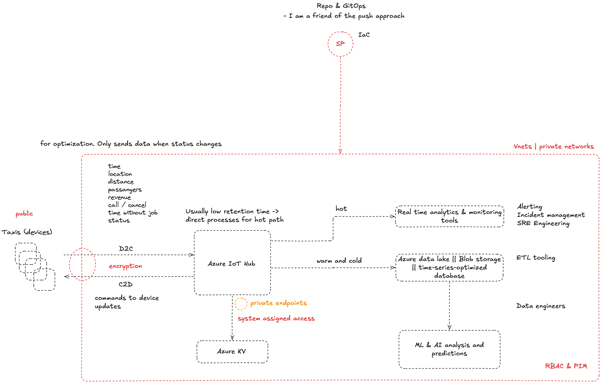

# assignment-sit

## Introduction

Imagine we are running a global business operating taxis in major cities of the world, in total its more
than 11.000 cars worldwide. Our taxis are operating 24/7/365 and complete small or large trips
throughout the day. From our headquarters we have to ensure many things in order to run the business,
e.g. we have to ensure receipts are generated for every trip, our management can review various
metrics from the trips (e.g. revenue per city, length of the trips, ...), we can prevent fraud or plan where
we place our taxis within the city throughout the day.

## Assignment

* Architecture
    – Design an architecture that allows us to collect, process and analyze data from our taxi operation as well as send data back to individual cars
* Automation
    – Develop a script to automate the setup and maintenance of your architecture. It’s ok if it’s only parts of it or 2-3 components and not the whole architecture. We should be able to rollout the components but also update the whole or individual parts
* Data Ex-filtration and Infiltration
    – Think about how to secure the data we are collecting for this use case and the platform in general. What tools and approaches can be used to minimize the risk of unwanted Data Exfiltration or Data Infiltration.
* Vision
    – Create a vision for the future of our taxi company data platform, what are going to be important pillars and elements that we should focus on in the next 2-3 years.

### Architecture

### Automation

Please see my Pulumi stack here: [Pulumi Stack](2-automation)

### Data Ex-filtration and Infiltration

General rules:

* Host the infrastructure / platform in private networks
* Use RBAC and PIM to control access to the platform and data for developers (additionally use a VPN gateway)
* Use managed identity for services to access other services
* Use Azure Key Vault to store secrets
* Use Azure Security Center to monitor and protect the platform
* Verify the public access of the devices to the platform: encrypt the data in transit and handle access
